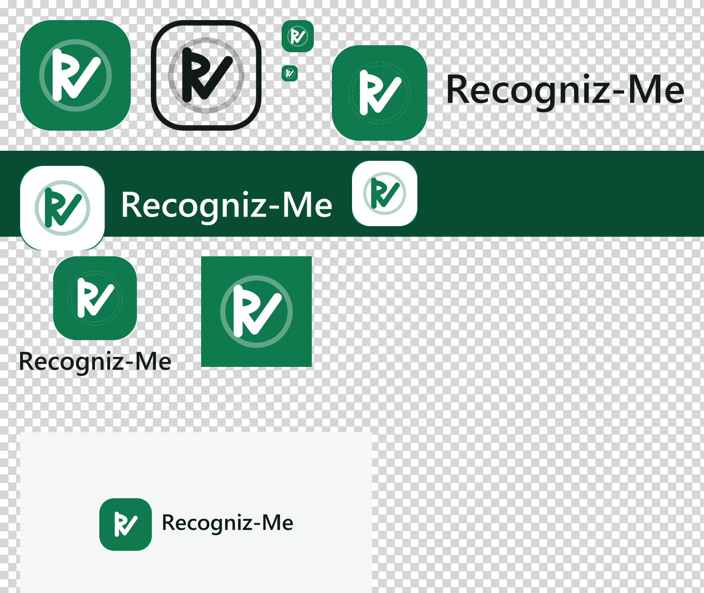

# Charte visuelle — Recogniz-Me

**Sprint :** M0 — identité visuelle  
**Version :** 1.2 — atmosphère vitrine `site.css` (§6), consommée par M1  
**Date :** 2 septembre 2026  
**Statut :** livré (as-built)  
**Source technique :** [`packages/brand`](../../packages/brand)

**Documents liés**

- [`cahier-des-charges-mvp.md`](./cahier-des-charges-mvp.md) — §7 identité visuelle
- [`roadmap-implementation-mvp.md`](./roadmap-implementation-mvp.md) — sprint M0

Ce document décrit **ce qui a été construit** en M0. Le critère du sprint : *un développeur produit une nouvelle page sans inventer une couleur*.

---

## 1. Décision de direction

| Sujet | Décision |
|---|---|
| Thème | **Clair**, sur toutes les surfaces |
| Accent | **Vert** `#0F7A4D` |
| Portée du vert | Ce qui **agit** (bouton, lien) et l’état **approuvé**. Rien d’autre |
| Atmosphères | Console = chrome d’application · Flow = calme, sans chrome |
| Familles typo | **Une** sans-serif système |

Cette décision **remplace** la proposition sombre / navy du CDC §7.3 (le CDC est mis à jour en conséquence).

---

## 2. Palette

Toutes les valeurs vivent dans [`packages/brand/tokens.css`](../../packages/brand/tokens.css). Aucune autre surface ne déclare de couleur — seule exception documentée : le gabarit e-mail (les clients de messagerie n’appliquent pas les variables CSS).

### Marque

| Token | Valeur | Usage |
|---|---|---|
| `--rm-accent` | `#0F7A4D` | Boutons, actions, état approuvé |
| `--rm-accent-hover` | `#0B6340` | Survol |
| `--rm-accent-active` | `#084D32` | Appui |
| `--rm-accent-subtle` | `#EEF7F2` | Fonds de badge / encart |
| `--rm-link` | `#0B6340` | Liens dans le texte |
| `--rm-focus` | `#084D32` | Anneau de focus |

### Surfaces et texte

| Token | Valeur | Usage |
|---|---|---|
| `--rm-bg` | `#F4F7F5` | Fond de page (console) |
| `--rm-surface` | `#FFFFFF` | Cartes, barre de nav, fond du flow |
| `--rm-surface-sunken` | `#EAEFEC` | Squelettes de chargement, survol secondaire |
| `--rm-text` | `#111A15` | Texte principal |
| `--rm-text-muted` | `#5A6B62` | Texte secondaire, libellés |
| `--rm-border` | `#DDE5E0` | Bordures de carte |
| `--rm-border-strong` | `#C7D3CC` | Bordures de champ, bouton secondaire |

Les neutres sont légèrement teintés vert : ils restent dans la marque au lieu d’un gris froid génériques.

### Tons de statut

Chaque ton est une **paire** fond + texte. Le badge affiche toujours un libellé (CDC §7.4 : jamais l’information par la seule couleur).

| Ton | Fond | Texte | Contraste | Sémantique |
|---|---|---|---|---|
| `neutral` | `#EEF1F4` | `#475569` | 6,7:1 | Expirée, annulée |
| `info` | `#E7F0FB` | `#1D5FA8` | 5,6:1 | Créée |
| `progress` | `#E0F1E8` | `#084D32` | 8,4:1 | En cours (capture) |
| `success` | `#EEF7F2` | `#0F7A4D` | 4,8:1 | Approuvée |
| `warning` | `#FDF3DC` | `#8A5A00` | 5,4:1 | Attente d’une action |
| `danger` | `#FCEAE9` | `#B3261E` | 5,6:1 | Refusée, erreur |

`success` partage la valeur du vert de marque : « approuvé » **est** la promesse du produit. Le token reste distinct de `--rm-accent` et peut diverger sans toucher aux boutons.

---

## 3. Accessibilité

Contrastes mesurés (WCAG 2.2 AA exige 4,5:1 pour le texte normal) :

| Paire | Ratio |
|---|---|
| Texte sur fond de page | 15,7:1 |
| Texte secondaire sur fond de page | 5,3:1 |
| Blanc sur bouton vert | 5,4:1 |
| Lien sur fond blanc | 7,4:1 |

Autres garanties :

- Anneau de focus unique (`:focus-visible`, 2 px, décalage 2 px) — visible sur fond clair **et** sur bouton vert.
- Aucun statut porté par la seule couleur : badge = pastille + libellé.
- Logo lisible dès **16 px** (forme pleine, pas de trait fin).

---

## 4. Logo

Un **sceau** : tuile arrondie verte, cercle discret, **R** blanc dont la jambe est une coche. Il dit « reconnu » et « vérifié », pas « surveillé » — ni œil, ni empreinte, conformément au CDC §7.3. Le nom s’écrit toujours `Recogniz-Me`, avec le trait d’union et la capitale au `M`.



### 4.1 Dans l’interface : le vectoriel

Composants : `Logo`, `Wordmark` ([`packages/brand/src/logo.tsx`](../../packages/brand/src/logo.tsx)). Ils tirent leurs couleurs des tokens et restent nets à toute taille : **c’est la forme de référence dès qu’une surface peut afficher du SVG.**

| Variante | Usage |
|---|---|
| `tone="accent"` | Défaut : tuile verte, R-coche blanc |
| `tone="inverse"` | Sur un bandeau vert ou sombre |
| `tone="mono"` | Une seule couleur (impression, fax de conformité) |
| `variant="mark"` | Sans le nom : espaces contraints |

Fichiers statiques : [`assets/icon.svg`](../../packages/brand/assets/icon.svg) (favicon, repris dans `web/console/app/icon.svg` et `web/flow/app/icon.svg`) et [`assets/icon-512.svg`](../../packages/brand/assets/icon-512.svg).

### 4.2 Hors interface : les exports raster

Pour les surfaces qui n’acceptent pas de SVG — clients de messagerie, aperçus de partage, avatars de plateforme, magasins d’applications. Tous dans [`packages/brand/assets/logo/`](../../packages/brand/assets/logo), tous en PNG, **fond transparent** sauf mention contraire.

| Fichier | Forme | Usage |
|---|---|---|
| `mark-accent-{512,256,128,64,40,32}.png` | Sceau vert, R-coche blanc | Icônes d’application, favicon de repli, en-tête d’e-mail |
| `logo-40.png` | Copie de `mark-accent-40` | Nom attendu par le gabarit e-mail, à héberger sur `recogniz.me/email/` |
| `mark-inverse-{512,128}.png` | Sceau blanc, R-coche vert | Sur fond vert ou sombre |
| `mark-mono-{512,128}.png` | Une seule encre `--rm-text` | Impression une couleur, gravure, télécopie |
| `lockup-accent.png` | Sceau + nom, horizontal | Signature sur fond clair |
| `lockup-inverse.png` | Sceau + nom en blanc | Signature sur fond vert ou sombre |
| `lockup-stacked.png` | Sceau au-dessus du nom | Formats étroits ou carrés |
| `avatar-{1024,512}.png` | Sceau à fond perdu, **opaque** | Photo de profil : les plateformes recadrent en cercle |
| `og-1200x630.png` | Signature centrée sur `--rm-bg`, **opaque** | `og:image` et `twitter:image` |

Les lockups sont détourés au ras du dessin : l’espacement appartient à la mise en page, pas au fichier.

### 4.3 Chaîne de production

Les fichiers de `logo/source/` sont les **masters raster** du sceau (géométrie du SVG + wordmark). Ils ne sont jamais livrés tels quels : `build.py` ramène les couleurs aux tokens, redessine la silhouette, et dérive les tailles.

| Script | Rôle |
|---|---|
| [`logo/render_sources.py`](../../packages/brand/assets/logo/render_sources.py) | Redessine les masters raster à partir de la géométrie du SVG |
| [`logo/build.py`](../../packages/brand/assets/logo/build.py) | Produit les exports : couleurs ramenées aux valeurs exactes des tokens, silhouette du sceau redessinée géométriquement, fond évacué, tailles dérivées |
| [`logo/check.py`](../../packages/brand/assets/logo/check.py) | Contrôle : vérifie que l’aplat dominant de chaque export est un token et que le reste des pixels n’est que de l’antialiasing entre deux tokens ; produit la planche `preview.png` ci-dessus |

```bash
pip install -r packages/brand/assets/logo/requirements.txt
python packages/brand/assets/logo/render_sources.py
python packages/brand/assets/logo/build.py
python packages/brand/assets/logo/check.py   # sort en erreur si un export dérive
```

Outillage de design : ces dépendances Python ne sont requises ni pour construire ni pour exécuter le produit.

### 4.4 Tenue du logo

- **Espace de protection :** au moins la moitié de la hauteur du sceau, sur les quatre côtés.
- **Taille minimale :** 16 px pour le sceau seul, 96 px de large pour un lockup — en dessous, le nom se ferme.
- Le sceau ne se recolore pas, ne se dégrade pas, ne prend pas d’ombre, ne se déforme pas et ne s’incline pas.
- Le nom ne se recompose pas à la main : on utilise `Wordmark` ou un lockup livré.

---

## 5. Composants

Définis dans [`base.css`](../../packages/brand/base.css), disponibles sur toutes les surfaces.

| Classe | Rôle |
|---|---|
| `button` / `.rm-button` | Action primaire (vert). `data-variant="secondary"` pour le neutre |
| `.rm-card` | Encart sur surface blanche |
| `.rm-badge` + `data-tone` | Statut |
| `.rm-alert` | Erreur (rôle `alert`) |
| `.rm-eyebrow` | Sur-titre de marque |
| `.rm-lead` | Chapeau en texte secondaire |
| `.rm-stack` / `.rm-actions` | Empilement vertical / rangée d’actions |
| `.rm-skeleton` | Chargement |
| `.rm-url` | Coupure des URL longues |

Les champs (`input`, `label`), titres et liens sont stylés au niveau de l’élément : pas de classe à penser.

---

## 6. Atmosphères

Une seule marque, trois contextes.

| | Console ([`console.css`](../../packages/brand/console.css)) | Flow ([`flow.css`](../../packages/brand/flow.css)) | Vitrine ([`site.css`](../../packages/brand/site.css)) |
|---|---|---|---|
| Fond | `--rm-bg` (blanc cassé) | `--rm-surface` (blanc) | `--rm-surface`, sections alternées en `--rm-bg` |
| Chrome | Barre de nav + logo + liens | Aucun : logo discret, puis le contenu | En-tête collant (logo, nav, langue, CTA) + pied de page à colonnes |
| Largeur | 45 rem | 30 rem, centré | 68 rem (`--rm-width-site`) ; 45 rem pour le texte long |
| Corps de texte | 1 rem | 1,125 rem | 1 rem ; 1,125 rem en accroche |
| Boutons | Densité back-office | Cibles tactiles larges, pleine largeur sous 30 rem | Un seul bouton vert par section |

L’applicant ne doit pas avoir l’impression d’être dans un outil d’analyste. Le visiteur de la vitrine ne doit pas avoir l’impression d’être déjà dans le produit.

La vitrine ajoute son vocabulaire de mise en page (`.rm-shell`, `.rm-section`, `.rm-steps`, `.rm-checklist`, `.rm-table`, `.rm-price`, `.rm-notice`, `.rm-prose`) : ce sont des **compositions** de tokens, pas de nouvelles valeurs. La coche de `.rm-checklist` est découpée au masque CSS plutôt que chargée en image — même geste que le sceau du logo, zéro requête.

---

## 7. E-mail

Gabarit : [`packages/brand/email/base.html`](../../packages/brand/email/base.html). Tableaux et styles en ligne (contrainte des clients de messagerie), valeurs de tokens **recopiées en dur** avec la correspondance en commentaire.

Substitutions : `{{TITLE}}`, `{{PREHEADER}}`, `{{BODY}}`, `{{CTA_LABEL}}`, `{{CTA_URL}}`, `{{FOOTER_NOTE}}`.

Le premier usage réel (vérification d’adresse e-mail) arrive en **M2**.

---

## 8. Règles de tenue

| ID | Règle |
|---|---|
| **RG-BRAND-01** | Aucune valeur de couleur hors `tokens.css` (exception : gabarit e-mail, documentée). |
| **RG-BRAND-02** | Le vert habille l’action et l’approbation. Un titre ou un fond de page n’est jamais vert. |
| **RG-BRAND-03** | Une seule famille typographique. |
| **RG-BRAND-04** | Espacements et rayons pris dans l’échelle (`--rm-space-*`, `--rm-radius-*`). |
| **RG-BRAND-05** | Un statut affiche toujours un libellé. |
| **RG-BRAND-06** | `:focus-visible` n’est jamais retiré. |
| **RG-BRAND-07** | Nouvelle surface : importer `tokens.css` + `base.css`, puis son propre fichier d’atmosphère. Appliqué en M1 avec `site.css`. |
| **RG-BRAND-08** | Les exports raster du logo sont **générés** par `build.py`, jamais retouchés à la main. Un nouveau besoin de taille ou de variante s’ajoute au script. |
| **RG-BRAND-09** | Le SVG est la forme de référence du logo. Un PNG n’est employé que là où le SVG ne passe pas. |
| **RG-BRAND-10** | Aucune pièce d’identité réelle dans une image publique. Les gabarits portent `SPECIMEN` en clair. |
| **RG-BRAND-11** | Un visage sur la vitrine n’est jamais présenté comme un client, un utilisateur vérifié ou un cas réel. |
| **RG-BRAND-12** | Aucun visage humain généré par IA sur les surfaces publiques. Un visage est soit sous licence avec autorisation de modèle, soit absent. |
| **RG-BRAND-13** | Une illustration technique est en SVG et prend ses couleurs dans les tokens, jamais en dur. |
| **RG-BRAND-14** | Une image porteuse de texte d’interface existe en FR **et** en EN, ou est recadrée pour ne pas en porter. |

---

## 9. Imagerie et mouvement

Ouvert à partir de **M1**. Jusque-là, la vitrine était en abstraction CSS seule : lisible, mais d’une seule matière — chaque section ressemblait à la précédente quel que soit son traitement. Le site alterne désormais quatre registres, et c’est ce contraste de matière qui porte la composition.

### 9.1 Les quatre registres

| Registre | Ce qu’il porte | Forme |
|---|---|---|
| **Photographie** | La présence humaine : hero, cartes d’enjeu | Sous licence, autorisation de modèle. Fournie par vous, pas générée. |
| **Produit réel** | La preuve : écrans du flow et de la console, réponse d’API | Captures de nos propres surfaces, données `SPECIMEN` |
| **Illustration technique** | L’architecture, la comparaison, les glyphes | SVG dans les tokens, thémable sur l’encre |
| **Typographie** | L’argument | Aucune image |

Deux registres au maximum par section. Trois, c’est une vitrine de foire.

### 9.2 Le problème de calendrier, et comment on le contourne

La capture pièce et le selfie arrivent en **M4** ([roadmap](./roadmap-implementation-mvp.md)), les appels AWS en **M5**. La matière produit qu’un site de ce calibre montre — champs extraits, vignettes de session, décision motivée — **n’existe pas encore**.

Les emplacements de preuve produit sont donc des composants **interchangeables** (`DeviceFrame`, `ConsoleFrame`) : remplis aujourd’hui d’illustration, ils reçoivent les captures réelles en M4 et M5 en changeant une source, pas une section. On ne repaie pas la refonte dans deux sprints.

Ce qui est montrable aujourd’hui : le formulaire de création en console, l’écran de consentement du flow, et la requête / réponse réelles de `POST /v1/verifications`.

### 9.3 Budgets

| Emplacement | Format | Poids servi visé |
|---|---|---|
| Hero (élément LCP) | AVIF, `priority`, `srcset` | ≤ 120 kB au 1× |
| Carte d’enjeu | AVIF, différée | ≤ 60 kB |
| Illustration technique | SVG en ligne | ≤ 8 kB |

`aspect-ratio` est **toujours** figé : une image sans ratio déclaré décale la mise en page au chargement.

### 9.4 Mouvement

Un seul geste, déjà en place : le bloc monte de quelques pixels en s’opacifiant, une fois. S’y ajoutent le balayage de lecture du gabarit documentaire et la résolution en séquence des signaux.

Trois garde-fous, non négociables : `prefers-reduced-motion` neutralise l’état de départ, l’absence d’`IntersectionObserver` révèle immédiatement, et une règle `<noscript>` rend visible sans JavaScript. Une animation ne doit jamais pouvoir cacher du contenu.

Pas de parallaxe, pas de compteur qui s’incrémente, pas de bloc qui arrive par la droite.

---

## 10. Brancher une nouvelle surface

```tsx
// app/layout.tsx
import "@kyc/brand/tokens.css";
import "@kyc/brand/base.css";
import "@kyc/brand/console.css"; // ou flow.css, ou site.css
import "./globals.css";          // uniquement le spécifique de la surface
```

Ajouter `"@kyc/brand": "0.1.0"` aux dépendances et `transpilePackages: ["@kyc/brand"]` dans `next.config.ts`.

---

## 11. Hors périmètre

Reporté, volontairement :

- Mode sombre (le produit est clair ; à rouvrir seulement sur demande client)
- Traduction anglaise de la **console** (le flow et la vitrine gèrent FR/EN)
- Branding par organisation dans le flow (hors MVP, CDC §4.2)

Levé en M1 : illustrations, motion design et photographie — voir §9.
