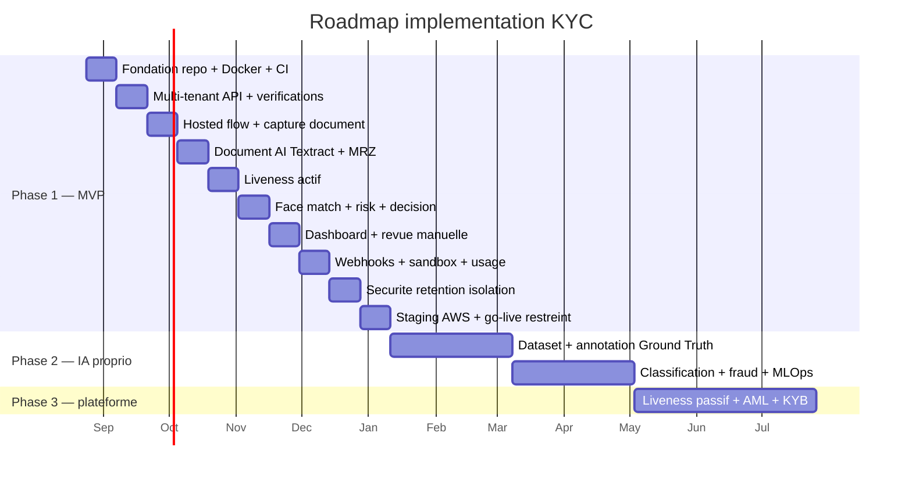

# Roadmap d’implémentation

**Produit :** Recogniz-Me — SaaS KYC avec moteur IA propriétaire  
**Stack :** Spring Boot 3 / Java 21 · PostgreSQL · Next.js · AWS  
**Date :** 23 août 2026  
**Horizon Phase 1 (MVP) :** 20 semaines — 10 sprints de 2 semaines  
**Phases 2 et 3 :** après go-live MVP, hors chemin critique du premier client

Ce document détaille **l’ordre de build**. La vision produit reste dans `cahier-des-charges.md`. Les concepts et cycles du parcours sont dans `tutoriel-pipeline-kyc.md`. L’architecture cible (modules, files, steps) est dans `architecture-implementation.md`.

---

## 0. Cadre

### Objectif du MVP

Un client B2B peut créer une vérification, envoyer un lien, capturer un document + un liveness actif, obtenir `APPROVED` / `REJECTED` / `MANUAL_REVIEW`, et récupérer le résultat via API et webhook.

Trois moteurs livrés : **Document** (Textract + MRZ + qualité) · **Liveness actif** · **Face match**. Scoring et décision par **règles Spring Boot**, pas par Bedrock.

### Équipe cible

| Rôle | Focus |
|---|---|
| Backend | Spring Boot, PostgreSQL, SQS, AWS SDK, moteurs de risque / décision |
| Frontend | Next.js console + hosted flow + capture caméra |
| Fullstack / DX | OpenAPI, sandbox, webhooks, docs d’intégration |
| Fondateur | Pays / types de documents V1, AWS, 1–2 design partners |

### Principes d’ordre

1. **Plateforme avant IA** — tenant, API, stockage, audit avant Textract.
2. **Parcours bout-en-bout dès que possible** — un happy path mocké avant les vrais appels AWS.
3. **AWS AI en accélérateur** — Textract + Rekognition ; pas d’endpoint SageMaker en V1.
4. **Décision auditable** — chaque `APPROVED` / `REJECTED` / `MANUAL_REVIEW` a des raisons persistées.
5. **Pas de PII dans les logs.**

### Hors V1 (ne pas commencer)

SageMaker endpoints 24/7, Ground Truth, OCR propriétaire, liveness passif, deepfake, AML/PEP/sanctions, KYB, SDK iOS/Android natif, Bedrock comme décideur.

---

## 1. Vue d’ensemble



Les dates du Gantt partent du **24 août 2026**. Les décaler si le kickoff change ; les durées restent les mêmes.

```
S0 Fondation → S1 API tenant → S2 Capture → S3 Document AI
     → S4 Liveness → S5 Décision → S6 Dashboard
     → S7 Webhooks → S8 Sécu → S9 Go-live
```

---

## 2. Décisions à figer avant le sprint 3

| Décision | Proposition V1 | Owner |
|---|---|---|
| Corridor documents | 2–4 pays, passeport + carte d’identité | Fondateur |
| Région AWS | `eu-west-1` (Irlande) ou `ca-central-1` | Fondateur |
| Liveness MVP | Rekognition Face Liveness **ou** challenge tête (tracking Rekognition) | Backend |
| Auth console | Email + mot de passe, 2FA au sprint 8 | Backend |
| Hébergement Next.js | ECS Fargate (SSR) ou CloudFront + S3 (statique) + BFF Spring | Frontend |
| Design partners | 1–2 fintechs sandbox pendant S6–S9 | Fondateur |

Sans liste pays × types de pièces, le classificateur V1 reste un stub.

---

## 3. Phase 1 — MVP (semaines 1–20)

Chaque sprint a un **livrable démontrable**. Si le livrable n’est pas là, le sprint suivant ne commence pas sur du nouveau scope : on termine.

---

### Sprint 0 — Fondation (S1–S2)

**But :** un développeur clone, lance, et a une API hello authentifiée.

| Couche | Travaux |
|---|---|
| Repo | `api` Spring Boot 3 / Java 21 · `web` Next.js App Router · `infra` Docker Compose |
| Local | PostgreSQL, Redis, LocalStack (S3, SQS, KMS) |
| Backend | Flyway, Actuator, Spring Security (clés API hashées), Springdoc OpenAPI |
| Données | `Organization`, `Membership`, `ApiKey` |
| CI | build + tests + lint sur PR |
| Front | app Next.js, login placeholder, layout console |

**Done when :** `docker compose up` + `POST /v1/health` + une org et une clé API en base.

**Kill :** stack locale instable → ne pas enchainer le métier.

---

### Sprint 1 — Vérifications et multi-tenant (S3–S4)

**Spécification détaillée :** [`docs/specs/sprint-01-verifications-multi-tenant.md`](./specs/sprint-01-verifications-multi-tenant.md)

**But :** créer et lire une vérification isolée par tenant.

| Couche | Travaux |
|---|---|
| API | `POST /v1/verifications` · `GET /v1/verifications/{id}` |
| Domaine | `Verification` (statuts `created` → …), `Consent`, `AuditEvent` append-only |
| Auth | `Authorization: Bearer` + `Idempotency-Key` sur POST |
| Isolation | filtre `organization_id` sur toutes les requêtes ; test de non-fuite |
| Tokens | token hosted flow TTL court (Redis) |
| Front | écran « nouvelle vérification » + copie du lien KYC |

**Done when :** le tenant A ne voit jamais le dossier du tenant B ; un lien KYC s’ouvre sur une page consentement vide.

---

### Sprint 2 — Hosted flow et capture document (S5–S6)

**But :** l’applicant capture une pièce, l’image arrive dans S3, le dossier passe `document.uploaded`.

| Couche | Travaux |
|---|---|
| Front flow | consentement horodaté · accès caméra · capture manuelle · recto/verso |
| Qualité client | flou, luminosité, crop, résolution — recapture avant upload |
| Upload | URL signée S3, jamais de média en clair dans l’API JSON |
| Backend | `Document`, worker SQS `document.uploaded` |
| Qualité serveur | contrôles basiques (taille, mime, dimensions) |

**Done when :** parcours mobile-first consentement → photo → fichier chiffré dans S3, événement interne émis.

Pas encore d’OCR.

---

### Sprint 3 — Document AI MVP (S7–S8)

**But :** extraire et normaliser les champs d’identité ; parser la MRZ.

| Couche | Travaux |
|---|---|
| OCR | Amazon Textract `AnalyzeID` (adapter) + normalizer `first_name`, `last_name`, `date_of_birth`, `document_number`, `expiration_date` |
| Classification V1 | allow-list pays × type (règles + heuristiques, pas de modèle custom) |
| MRZ | localisation / OCR texte · parsing · check digits · comparaison MRZ ↔ OCR |
| Pipeline | `document.processing` → `document.completed` |
| Mock | mode sandbox sans appel Textract (fixtures) |

**Done when :** un passeport de test (et une carte ID si dans l’allow-list) produit un JSON normalisé ; une incohérence MRZ/OCR pose un signal de risque.

**Couverture V1 :** 2–4 pays, quelques types. Tout le reste → message `unsupported_document`.

---

### Sprint 4 — Liveness actif (S9–S10)

**But :** prouver une présence réelle par challenge dynamique.

| Couche | Travaux |
|---|---|
| Front | caméra selfie/vidéo · consignes (« tournez la tête à gauche ») |
| Backend | session liveness, `liveness.started` / `liveness.completed` |
| IA | Rekognition Face Liveness **ou** DetectFaces + pose sur frames du challenge |
| Qualité visage | un seul visage, taille, pose, luminosité |

**Done when :** un vrai visage passe ; une photo imprimée ou un écran figé échoue ou part en `MANUAL_REVIEW` selon la règle V1.

Chaque tentative est journalisée (coût AWS + audit).

---

### Sprint 5 — Face match, risk, décision (S11–S12)

**But :** le pipeline complet se termine tout seul.

| Couche | Travaux |
|---|---|
| Face | crop portrait document · `CompareFaces` · `similarity_score` |
| Risk | agrégation document + liveness + match (règles configurables par org) |
| Decision | `APPROVED` / `REJECTED` / `MANUAL_REVIEW` + `reasons[]` persistées |
| API | `GET /v1/verifications/{id}/results` |
| Événements | `face_match.completed` · `risk.completed` · `verification.*` |

Règles V1 (exemple, à calibrer ensuite sur dataset) :

| Signal | Décision |
|---|---|
| Document expiré / type non supporté | `REJECTED` |
| Tamper / MRZ mismatch fort | `REJECTED` ou `MANUAL_REVIEW` |
| Liveness faible | `MANUAL_REVIEW` |
| Face match sous seuil | `MANUAL_REVIEW` ou `REJECTED` |
| Tous les checks au-dessus des seuils | `APPROVED` |

**Done when :** un happy path sandbox va de la création à `APPROVED` sans ingénierie ; un liveness raté ouvre une revue.

Seuils **provisoires** et versionnés en config — pas figés « au feeling » comme vérité produit.

---

### Sprint 6 — Dashboard et revue (S13–S14)

**But :** le client SaaS opère sans SQL.

| Écran | Contenu |
|---|---|
| Home | volume, taux succès / rejet / revue, temps moyen, conso |
| Liste | filtres statut, pays, date |
| Dossier | applicant · OCR · MRZ · qualité · liveness · match · risk · décision |
| File revue | assignation, notes, décision analyste |
| Médias | images via URL signée TTL court, jamais d’URL publique permanente |

**Done when :** un reviewer tranche un dossier `MANUAL_REVIEW` ; l’audit enregistre qui / quand / pourquoi.

---

### Sprint 7 — Webhooks, sandbox, usage (S15–S16)

**But :** un développeur client intègre sans Slack.

| Travaux |
|---|
| `POST /v1/webhooks` · secret · HMAC (`t=`, `v1=`) |
| Retry exponentiel, journal `WebhookDelivery`, replay |
| Événements listés au CDC §28 |
| Sandbox : pas d’appel Textract/Rekognition facturé, fixtures déterministes |
| `GET /v1/usage` · compteurs par org / check |
| Guide d’intégration « jour 1 » + OpenAPI publié |

**Done when :** un webhook de test reçoit `verification.approved` signé ; le sandbox rejoue le happy path.

---

### Sprint 8 — Sécurité et données (S17–S18)

**But :** le dossier biométrique n’est pas un jouet.

| Travaux |
|---|
| Chiffrement S3 + RDS (KMS) |
| 2FA console pour owner / reviewer |
| Rétention configurable + job de purge + *legal hold* |
| Suppression / export minimal (droits accès) |
| Revue des logs : zéro document, selfie, MRZ, numéro de pièce |
| Tests d’isolation tenant automatisés |
| Rate limit API + hosted flow (Redis) |

**Done when :** pentest léger interne + checklist sécu V1 cochée ; restore RDS testé une fois.

---

### Sprint 9 — Staging AWS et go-live restreint (S19–S20)

**But :** 1–2 design partners en production limitée.

| Travaux |
|---|
| ECS Fargate (API + workers) · RDS · ElastiCache · S3 · Secrets Manager · ALB |
| CloudWatch : latence, erreurs vendor, DLQ SQS |
| Status / runbook (timeout Textract, fallback, kill-switch IA) |
| Allow-list pays/documents figée |
| Charge : cible V1 honnête (ex. 20 req/s API, 50 sessions hosted) |
| DPA / mentions consentement parcours (legal, en parallèle) |

**Done when :** un applicant réel d’un design partner va au bout ; webhook livré ; aucun `APPROVED` si un check critique a échoué.

**Critères go-live (tous requis) :**

| ID | Critère |
|---|---|
| G1 | Happy path E2E sans intervention ingénierie |
| G2 | Isolation tenants prouvée par test |
| G3 | Décision + reasons + audit |
| G4 | Webhook signé + retry |
| G5 | Sandbox utilisable |
| G6 | Médias uniquement en URL signée |
| G7 | Région et KMS conformes au choix marché |

---

## 4. Livrables par sprint (récap)

| Sprint | Semaines | Livrable visible |
|---|---|---|
| 0 | 1–2 | Stack locale + CI + org/API key |
| 1 | 3–4 | CRUD vérifications multi-tenant + lien KYC |
| 2 | 5–6 | Capture document + S3 |
| 3 | 7–8 | OCR Textract + MRZ |
| 4 | 9–10 | Liveness actif |
| 5 | 11–12 | Face match + décision auto |
| 6 | 13–14 | Dashboard + file revue |
| 7 | 15–16 | Webhooks + sandbox + usage |
| 8 | 17–18 | Rétention, 2FA, isolation |
| 9 | 19–20 | Staging AWS + 1er partenaire |

---

## 5. Architecture de build (modules)

Cible détaillée : [`architecture-implementation.md`](./architecture-implementation.md).

Ordre de dépendance — ne pas inverser.

```
[0] org / api keys / audit
        ↓
[1] verification + consent + hosted token
        ↓
[2] media (S3) + quality
        ↓
[3] document pipeline (Textract, MRZ)
        ↓
[4] liveness pipeline
        ↓
[5] face match → risk → decision
        ↓
[6] dashboard / review
        ↓
[7] webhooks / usage / sandbox
        ↓
[8] retention / sécu
        ↓
[9] prod AWS
```

Backend unique (`api/`) :

- `entities` / `repositories` / `services` / `controllers` / `config`
- `ports` + `adapters` — Textract, Rekognition, S3
- `workers` — consommateurs SQS (même projet)
- `web/console` — Next.js dashboard
- `web/flow` — Next.js hosted flow  

---

## 6. Phase 2 — IA propriétaire (après MVP)

Démarrer **dès le sprint 3** la collecte (pipeline d’anonymisation + consentement dataset), mais **n’entraîner** qu’après un volume et un cadre legal.

Durée indicative : **16 semaines** après go-live.

| Bloc | Contenu | Prérequis |
|---|---|---|
| Dataset | documents légitimes / fraude, anonymisation, séparation prod/training | consentement + DPIA |
| Annotation | SageMaker Ground Truth (`document_type`, `country`, `fraud_type`, régions) | bucket training isolé |
| Classification custom | pays / type / version | dataset versionné |
| Fraud / tampering | features OCR+MRZ+image → modèle SageMaker | labels fraude |
| Liveness custom | modèle anti-spoof, comparaison vs Rekognition | vidéos annotées |
| MLOps | registry, staging, A/B, monitoring, retrain | eval FAR/FRR, APCER/BPCER |

**Règle :** un endpoint GPU n’existe en prod que si le volume rend le coût / vérif inférieur à Rekognition/Textract, **et** que les métriques battent le baseline AWS.

Bedrock en Phase 2 seulement pour **résumé de dossier** et aide analyste — jamais pour la décision finale.

---

## 7. Phase 3 — plateforme avancée

Après des modèles V2 stables. Pas de date unique : lots indépendants.

| Lot | Contenu |
|---|---|
| Liveness passif | UX sans challenge, même barre de sécu |
| Anti-fraude avancée | deepfake, injection, device intelligence, réseaux de fraude |
| AML | sanctions, PEP, adverse media |
| KYB | entreprise, UBO |
| Monitoring | re-KYC, alertes continues |

---

## 8. Jalons d’arrêt (kill)

| Quand | Si… | Alors |
|---|---|---|
| Fin S2 | pas de capture S3 fiable | ne pas brancher Textract |
| Fin S4 | liveness inutilisable sur mobile réel | revoir le fournisseur / le challenge avant le dashboard |
| Fin S6 | pas de revue humaine opérable | pas de pitch « compliance » |
| Fin S8 | fuite PII dans les logs ou entre tenants | freeze features, corriger |
| Fin S9 | 0 design partner | produit technique, pas encore un SaaS |

---

## 9. Risques d’implémentation

| Risque | Impact | Mitigation dans la roadmap |
|---|---|---|
| Scope « comme Onfido » | 12 mois de retard | Phase 2/3 hors sprints 0–9 |
| SageMaker trop tôt | COGS explose à bas volume | inférence managée V1 seulement |
| Qualité capture faible | revue humaine = coût n°1 | S2 qualité client **avant** OCR |
| Retries liveness | facture Rekognition | journaliser chaque attempt ; cap UX |
| Pays non figés | classificateur jetable | décision avant S3 |
| Bedrock « décideur » | non auditable | interdit en V1 |

---

## 10. Definition of Done — Phase 1

Le MVP est **implémenté** lorsque :

1. Stack Spring Boot + PostgreSQL + Next.js en staging AWS.  
2. Parcours : création → lien → consentement → document → liveness → match → décision.  
3. 2–4 pays et types de documents en allow-list.  
4. API `/v1` + webhooks HMAC + sandbox.  
5. Dashboard volume + dossier + file revue.  
6. Audit, isolation tenant, KMS, rétention.  
7. Aucun modèle propriétaire en production (baseline AWS AI).  

La Phase 2 commence quand G1–G7 (sprint 9) sont verts **et** qu’un cadre dataset (anonymisation, base légale) existe.
